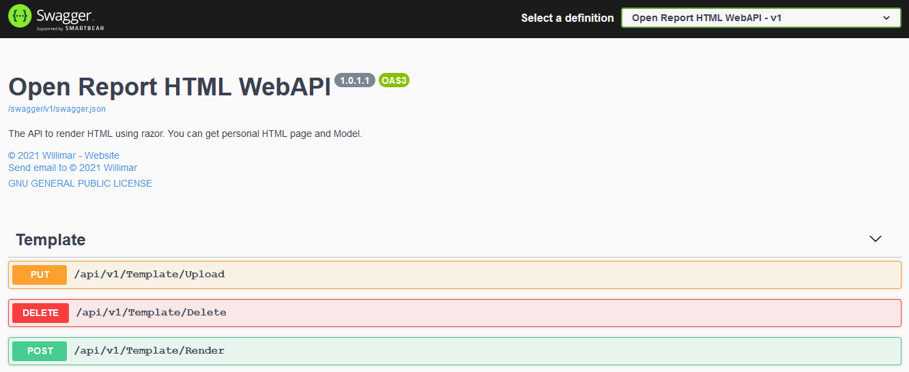

# OpenReportHtml
The API to render HTML using razor. You can get personal HTML page and Model.

The project is in net5.0.

## Building the project

Clone the project ```git clone https://github.com/willimar/OpenReportHtml.git```

Open the solution ```OpenReportHtml.sln``` and press Ctrl+Shift+B. The project will restore all dependences and build the application. To debug application execute F5 and wait the brownser open. After open the swagger ui will show the controller options.



## Compiling new docker image

The repository is automatic, when made new push code to main the Docker Hub was compile new image, but to manual compile image use Dockerfile.
Command to build image: "```docker build -t open-report-html .```"

To execute the image use the command ```docker run -p 8003:80 open-report-html```.

To see the resulted open url ```http://localhost:8003``` in your webbrownser.

## Understand the actions in controllers

The API has only one controller ```TemplateController``` in the version one. To test the controller's action you can use swagger ui controls. 

Open the project in brownser and in the action click in ```Try it out``` button, put the fields values and click in ```Execute``` button.

### /api/v1/Template/Upload

* Use the http PUT method
* Has only one parameter: the files, where files is the a cshtml file list.

This action will save the file in local templage path configured in application.

### /api/v1/Template/Delete

* Use the http DELETE method
* Has only one parameter: the file name, where file name is the name of the file sended.

This action will remove the file from template path.

### /api/v1/Template/Render

* Use the http POST method
* Has two parameters: file name and model, where file name is a name of the file to render and model is a string with the json format where this json will be deserialised and used as model in render file.

This action will render the file and return html content.
